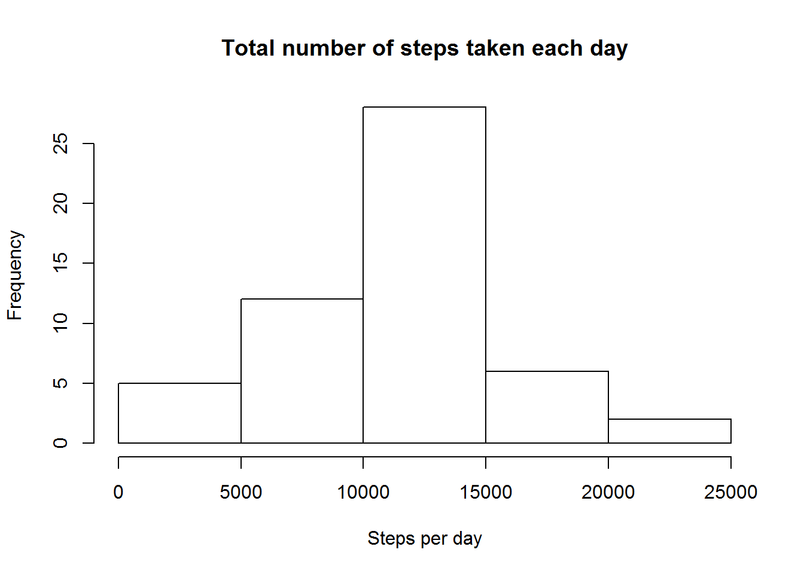
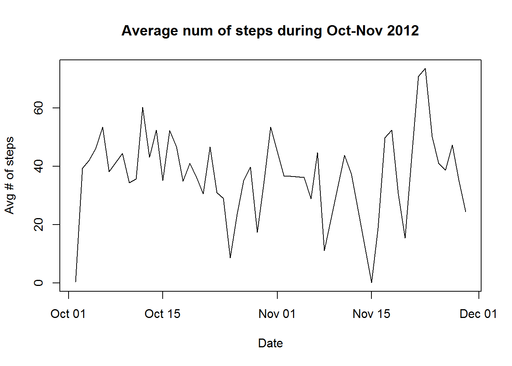
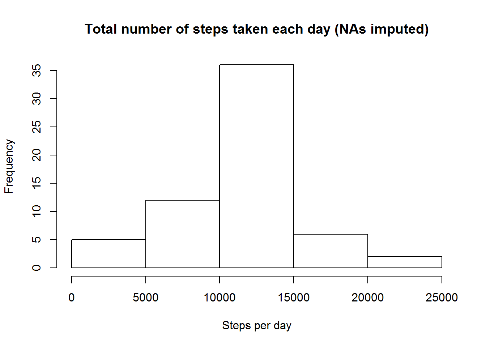
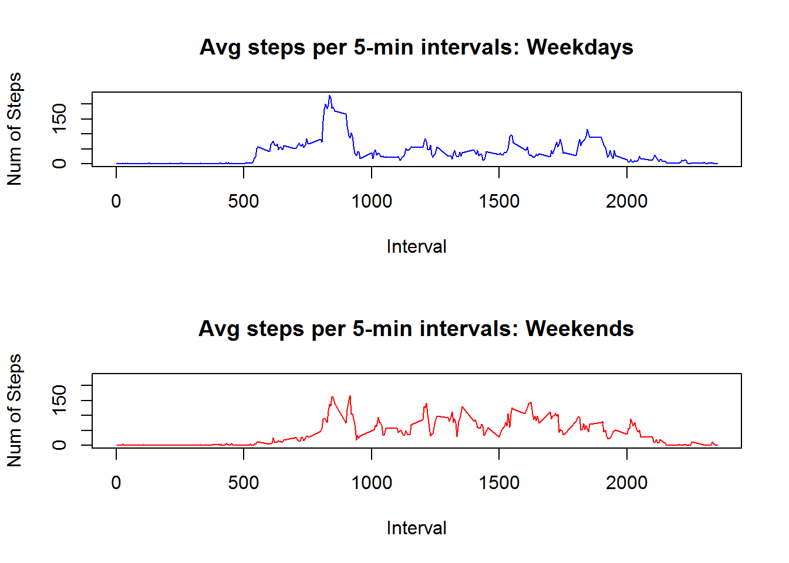

This is an R Markdown document containing the responses and code corresponding to the 8 questions that are a part of the Reproducible Research course project 1. [link](https://www.coursera.org/learn/reproducible-research/peer/gYyPt/course-project-1)

This project makes use of data from a personal activity monitoring device, that collects data at 5 minute intervals through out the day. The data consists of two months of data from an anonymous individual collected during the months of October and November, 2012 and include the number of steps taken in 5 minute intervals each day.

**1. Code for reading in the dataset and/or processing the data**

```r
actData <- read.csv("activity.csv", header = TRUE)
actData$date <- as.Date(actData$date,"%Y-%m-%d")
```

**2. Histogram of the total number of steps taken each day**

```r
library(reshape2)
actMelt <- melt(actData, id=c("date"), measure.vars = c("steps"), na.rm = TRUE)
actSum <- dcast(actMelt, date ~ variable, sum)
hist(actSum$steps, xlab = "Steps per day", main = "Total number of steps taken each day")
```



**3. Mean and median number of steps taken each day**

```r
mean(actSum$steps, na.rm = TRUE)
```

```
## [1] 10766.19
```

```r
median(actSum$steps, na.rm = TRUE)
```

```
## [1] 10765
```

**4. Time series plot of the average number of steps taken**

```r
actMean <- dcast(actMelt, date ~ variable, mean)
plot(actMean$date, actMean$steps, type = "l", xlab = "Date", ylab = "Avg # of steps", main = "Average num of steps during Oct-Nov 2012")
```



**5. The 5-minute interval that, on average, contains the maximum number of steps**

```r
maxStepsRow <- subset(actData, steps == max(actData$steps, na.rm = TRUE))
maxStepsRow$interval
```

```
## [1] 615
```

**6. Code to describe and show a strategy for imputing missing data**
First, we look at the number of missing values and the corresponding dates.
Then to impute missing data, we replace the missing steps data (NAs) with the average number of steps taken during the same interval (corresponding to the missing steps data).


```r
#Total number of missing values in the dataset.. 
sum(is.na(actData))
```

```
## [1] 2304
```

```r
sum(is.na(actData$steps))
```

```
## [1] 2304
```

```r
#Dates correponding to the missing steps values (NAs)..
unique(actData$date[is.na(actData)])
```

```
## [1] "2012-10-01" "2012-10-08" "2012-11-01" "2012-11-04" "2012-11-09"
## [6] "2012-11-10" "2012-11-14" "2012-11-30"
```

```r
#Compute average number of steps per interval..
actIntMelt <- melt(actData, id=c("interval"), measure.vars = c("steps"), na.rm = TRUE)
actIntMean <- dcast(actIntMelt, interval ~ variable, mean)

#Create a copy of original data (to be used for imputing missing values)..
actDataNoNA <- actData

#Replace NAs with average number of steps taken during the same interval..
actDataNoNA$steps <- ifelse(
        is.na(actDataNoNA$steps),
        actIntMean$steps[match(actDataNoNA$interval,actIntMean$interval)],
        actDataNoNA$steps
)
```

**7. Histogram of the total number of steps taken each day after missing values are imputed**

```r
actNoNaMelt <- melt(actDataNoNA, id=c("date"), measure.vars = c("steps"))
actNoNaSum <- dcast(actNoNaMelt, date ~ variable, sum)
hist(actNoNaSum$steps, xlab = "Steps per day", main = "Total number of steps taken each day (NAs imputed)")
```



```r
#Mean total number of steps taken per day (using data that has no NAs).. 
mean(actNoNaSum$steps)
```

```
## [1] 10766.19
```

```r
#Median total number of steps taken per day (using data that has no NAs).. 
median(actNoNaSum$steps)
```

```
## [1] 10766.19
```
Imputing missing data doesn't have any effect on the mean total daily number of steps taken per day (10766.19, in both cases).
However, the median total number of steps taken per day when missing values are imputed (10766.19) is slightly higher than the median value with the original data (10765).  

**8. Panel plot comparing the average number of steps taken per 5-minute interval across weekdays and weekends**

*Compute average number of steps for weekdays(Mon-Fri) and weekend(Sat, Sun)*

```r
#Add a new variable to actDataNoNa, specifying if its a weekday or weekend.. 
getWK <- function(x){weekdays.Date(x)}
actDataNoNA$wtype <- sapply(actDataNoNA$date, getWK)

#Compute average number of steps per 5-mt interval during weekdays
actDataWkday <- subset(actDataNoNA, wtype != "Saturday" & wtype != "Sunday")
actWkdayMelt <- melt(actDataWkday, id=c("interval"), measure.vars = c("steps"))
actWkdayMean <- dcast(actWkdayMelt, interval ~ variable, mean)

#Compute average number of steps per 5-mt interval during weekends
actDataWkend <- subset(actDataNoNA, wtype == "Saturday" | wtype == "Sunday")
actWkendMelt <- melt(actDataWkend, id=c("interval"), measure.vars = c("steps"))
actWkendMean <- dcast(actWkendMelt, interval ~ variable, mean)

maxSteps = max(actWkdayMean$steps, actWkendMean$steps)
par(mfcol = c(2,1))
plot(actWkdayMean$interval, actWkdayMean$steps, ylab = "Num of Steps", xlab ="Interval", ylim = c(0, maxSteps), type = "l", col = "blue", main = "Avg steps per 5-min intervals: Weekdays")

plot(actWkendMean$interval, actWkendMean$steps, ylab = "Num of Steps", xlab ="Interval", ylim = c(0, maxSteps), type = "l", col = "red", main = "Avg steps per 5-min intervals: Weekends")
```



